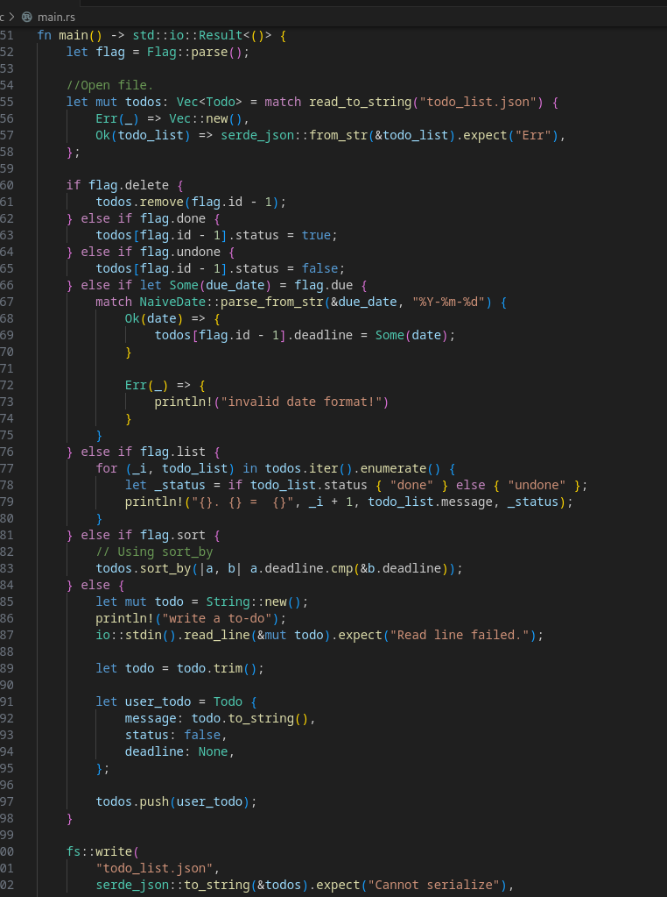
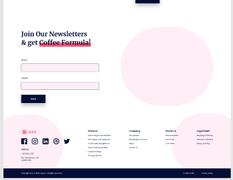
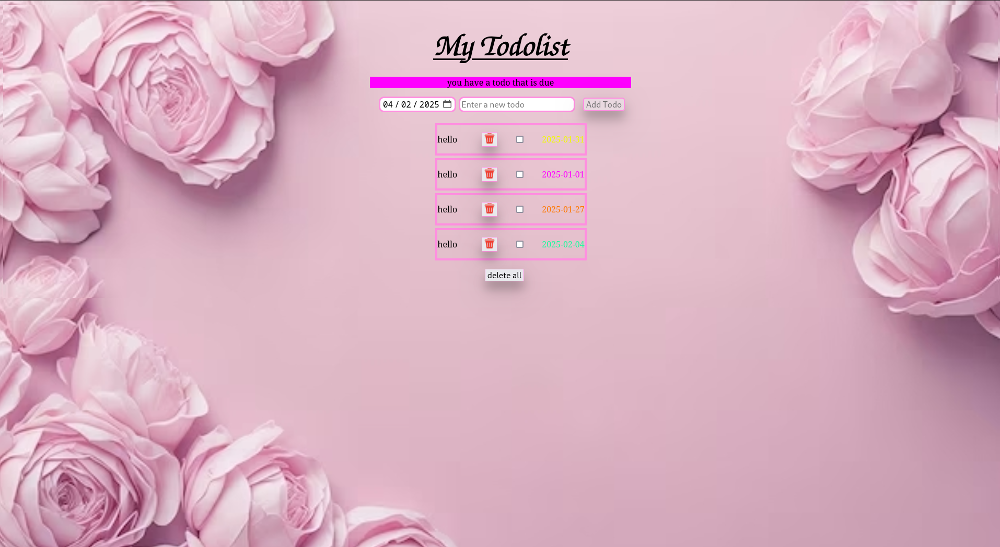

import { Badge } from '@astrojs/starlight/components';

## Rust todo list
<a href="/raporte-de-formation/projects/rust-todo-list">
<Badge text="Rust" variant="note" />
</a>
<Badge text="Serde" variant="caution" />
<Badge text="Clap" variant="caution" />
<Badge text="chrono" variant="caution" />

réalisation d'une todo-liste en rust
premier projet du semaistre

(1 ere année d'apprentissage)

## Site statique

<a href="/raporte-de-formation/projects/site-statique-HTML-CSS">
<Badge text="HTML" variant="note" />
</a>
<Badge text="CSS" variant="note" />

Ce projet m'as permis de réaliser a l'aide d'une maquette et de la reproduire en pixel perfect

ce projet a servis a construire une basse pour tout les autre projet.

## typescript Todo List
<a href="/raporte-de-formation/projects/JavaScript-TypeScript">
<Badge text="typescript" variant="note" />
</a>
<Badge text="HTML" variant="note" />
<Badge text="CSS" variant="note" />

todo liste avec une page web.

ce projet m'as permis de mélangé trois language de programation

