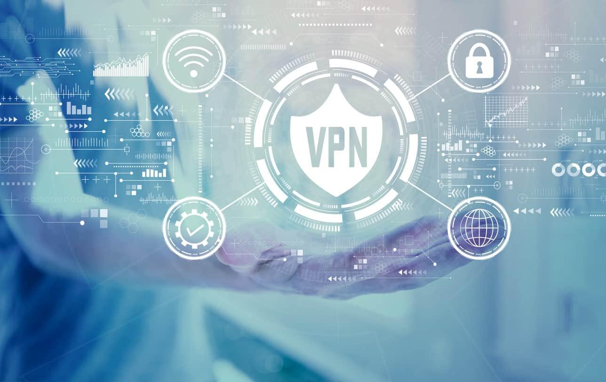

j'ai travail sur des projet client Pour installer le spiderBus et 
faire des GED
utilisation de VPN et de RDP

### VPN 
- openVPN GUI 
- FortiVPN 
- VPN (paramètre)

## Qu'est qu'VPN 

 
 un VPN est un tunel sécuriser et cripté, aggisant comme 
 un intermédiaire entre nous et le client,
 il permet de protéger la confidentialiter 

 ## Qu'est qu'un RDP 

 un RDP est un protocole de communication réseau développé par microsoft
qui permet aux utilisateur de ce connecter et de controler un session sur
un ordinateur a Distance.

