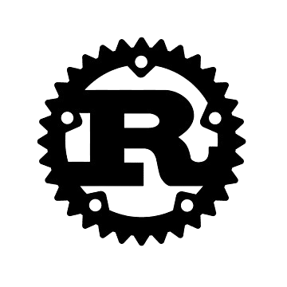
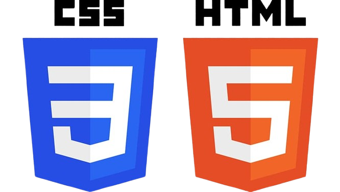
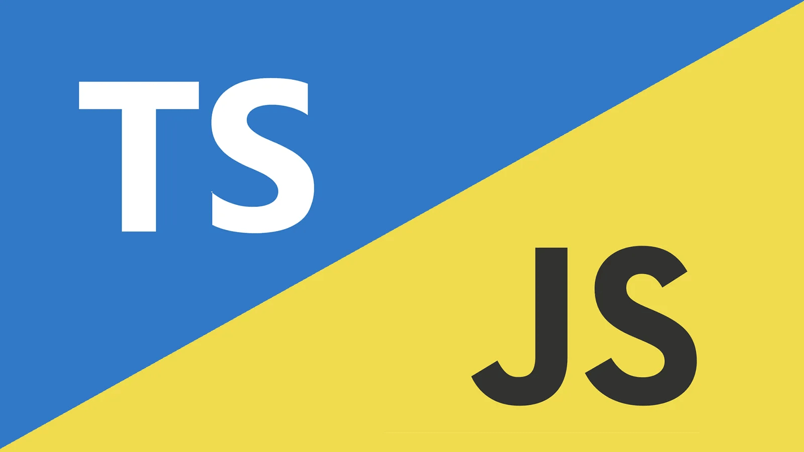

## Rust


Rust est un langage de programmation compilé. Il a un niveau relativement élevé en 
syntax.

le compilateur nous signale les erreurs ou des fautes de syntax

### Code example

```rust
fn main() {
    println!("Hello World!");
}
```

## HTML SCC



HTML est untiliser pour la mise en forme d'une page.

le CSS est pour le desing de la page.

Ce sont des languages descriptif qui se complete avec des balises

### Code example

```html
 <div class="title-craft">
                <p>We craft experiences for business to help reach our customers</p>
            </div>
```
```CSS
.texte-craft {
    margin-bottom: 60px;
    width: 481px;
    height: 96px;
    font-family: "Merriweather", serif;
    font-weight: 400;
    font-size: 18px;
    line-height: 32px;
}
```
## JavaScripte TypeScripte



 javasript est un langage dynamique multi-paradigmes
 
typesripte est la même chose que javascripte mais avec des types 
il n'y pas énormément de syntax

### Code example

```typescript
function deleteTodo(index: number) {
  if (todoList) {
    todos.splice(index, 1)
    localStorage.setItem('value', JSON.stringify(todos))
    todoList.innerHTML = ''
    todos.forEach(addTodo)
  }
}

```